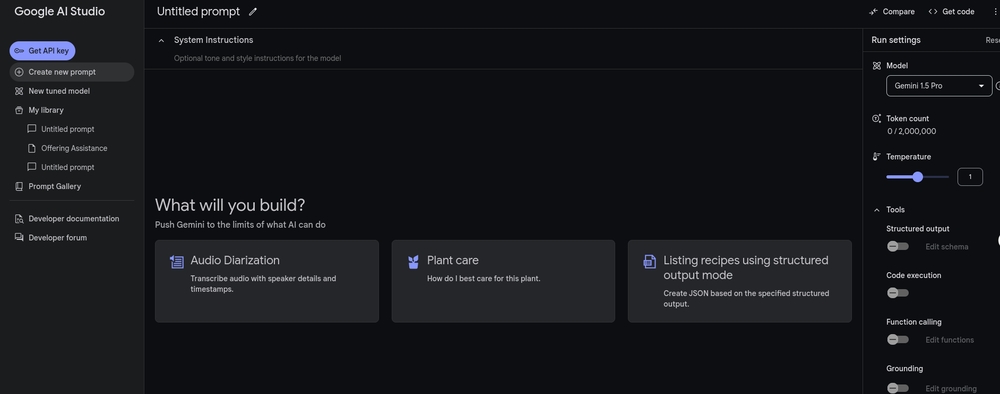
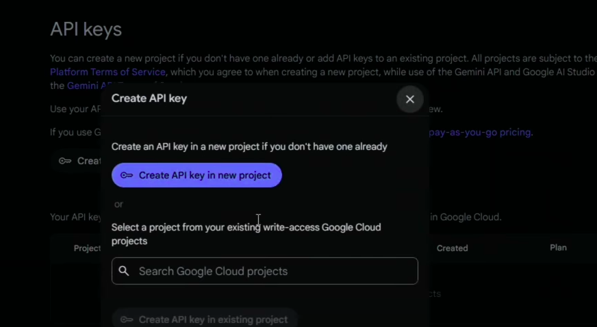

# AI
## OCR
### Cấu trúc thư mục
```bash
├── Dockerfile
├── __init__.py
├── main.py
├── ocr
│   ├── best.pt
│   ├── config.py
│   ├── __init__.py
│   ├── main_ocr.py
│   ├── models.py
│   └── utils
│       ├── image_utils.py
│       ├── __init__.py
│       ├── ocr_utils.py
│       └── yolo_utils.py
├── README.md
└── requirements.txt

```

# **Yêu Cầu Hệ Thống** 
- **Python**: Python 3.10 trở lên.
- **Docker**

### Cài đặt môi trường

1. **Cài đặt các thư viện cần thiết từ file `requirements.txt`:**

    Đảm bảo bạn đang ở trong thư mục `AI`, sau đó chạy lệnh:
    ```bash
    pip install -r requirements.txt
    ```
2. **Chạy module AI:**
    Sử dụng `uvicorn` để chạy API:
    ```bash
    uvicorn main:app --host 0.0.0.0 --port 8000
    ```
    Hoặc, nếu bạn muốn chạy ứng dụng trong container Docker, hãy thực hiện các bước sau:
    - Xây dựng Docker image:
        ```bash
        docker build -t ai-module .
        ```
    - Chạy container:
        ```bash
        docker run -d -p 8000:8000 my-fastapi-app
        ```
**Kết thúc**: bạn có thể gọi api tại http://localhost:8000
### Mô tả chức năng chính

**`/process-image/`**: API sẽ nhận một tệp ảnh, sử dụng mô hình YOLOv11 để phát hiện các đối tượng trong ảnh, sau đó sử dụng mô hình OCR để nhận dạng văn bản từ các vùng ảnh đã được cắt ra. 

**Các hàm chính:**
- `load_yolo_model`: Tải mô hình YOLO từ đường dẫn đã cấu hình.
- `load_ocr_model`: Tải mô hình OCR từ cấu hình.
- `crop_image`: Cắt vùng ảnh theo tọa độ được xác định bởi YOLO.
- `preprocess_image`: Tiền xử lý ảnh để sẵn sàng cho OCR.
- `clean_text`: Làm sạch văn bản đã nhận dạng.

- **Quy trình**:
  1. Text detection: trích xuất ra các vùng ảnh được huấn luyện
  2. Xử lý ảnh
  3. Chèn hình ảnh con dấu vào trang PDF.
  4. Trả về file PDF đã được chèn con dấu.


## Gemini API
Thư mục này chứa các mô-đun AI và xử lý dữ liệu liên quan đến trí tuệ nhân tạo (AI). Gồm 2 chức năng là thực hiện chữ ký số  khi thêm con dấu vào file pdf và thêm 


# Tạo API Gemini 
## Bước 1: truy cập vào [link](aistudio.google.com) để vào trang tạo API, sẽ có giao diện như sau
## Bước 2: Nhấn vào *Get API key* ở góc trên bên phải để đến màn hình
## Bước 3: Chọn *Create API key* rồi chọn *Create API key in new project* hoặc chọn project có sẵn nếu có 
## Bước 4: Chọn *Copy* để sao chép API key rồi thực hiện lệnh sau để test API
```bash
curl "https://generativelanguage.googleapis.com/v1beta/models/gemini-1.5-flash:generateContent?key=${GEMINI_API_KEY}" \
    -H 'Content-Type: application/json' \
    -X POST \
    -d '{
      "contents": [{
        "parts":[{"text": "Write a story about a magic backpack."}]
        }]
       }'
```

**Ngoài ra**: Các bạn có thể thực hiện theo [Hướng dẫn](https://ai.google.dev/gemini-api/docs/api-key?hl=vi) này