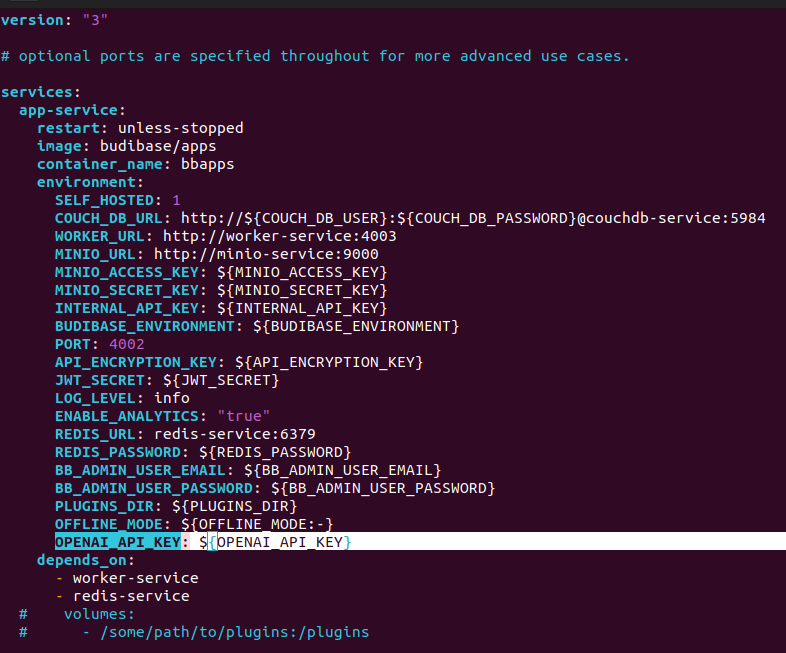

# AI
Thư mục này chứa các mô-đun AI và xử lý dữ liệu liên quan đến trí tuệ nhân tạo (AI).   
- Data cho việc train model yolov11: [link](https://drive.google.com/file/d/1Tbjlu5EW1jrnpt7lmR0CKzr26LCUtnRn/view?usp=sharing) - bộ data được tạo và gán nhãn trên [roboflow](https://app.roboflow.com/)

### Cấu trúc thư mục
```bash
.
├── digital_sig
│   ├── __init__.py
│   ├── insert_stamp.py
│   ├── main_digital_sig.py
│   ├── make_dig_sig.py
│   ├── requirements.txt
│   ├── sign_pdf.py
│   ├── utils.py
│   └── verify_pdf_signature.py
├── Dockerfile
├── __init__.py
├── main.py
├── ocr
│   ├── best.pt
│   ├── config.py
│   ├── __init__.py
│   ├── main_ocr.py
│   ├── models.py
│   └── utils
│       ├── image_utils.py
│       ├── __init__.py
│       ├── ocr_utils.py
│       └── yolo_utils.py
├── __pycache__
│   └── main.cpython-310.pyc
├── README.md
└── requirements.txt

```

# **Yêu Cầu Hệ Thống** 
- **Python**: Python 3.10 trở lên.
- **Docker**

### Cài đặt môi trường

1. **Cài đặt các thư viện cần thiết từ file `requirements.txt`:**

    Đảm bảo bạn đang ở trong thư mục `AI`, sau đó chạy lệnh:
    ```bash
    pip install -r requirements.txt
    ```
2. **Chạy module AI:**
    Sử dụng `uvicorn` để chạy API:
    ```bash
    uvicorn main:app --host 0.0.0.0 --port 8000
    ```
    Hoặc, nếu bạn muốn chạy ứng dụng trong container Docker, hãy thực hiện các bước sau:
    - Xây dựng Docker image:
        ```bash
        docker build -t ai-module .
        ```
    - Chạy container:
        ```bash
        docker run -d -p 8000:8000 my-fastapi-app
        ```
**Kết thúc**: bạn có thể gọi api tại http://localhost:8000

## OCR
### Mô tả chức năng chính

**`/process-image/`**: API sẽ nhận một tệp ảnh, sử dụng mô hình YOLOv11 để phát hiện các đối tượng trong ảnh, sau đó sử dụng mô hình OCR để nhận dạng văn bản từ các vùng ảnh đã được cắt ra. 

**Các hàm chính:**
- `load_yolo_model`: Tải mô hình YOLO từ đường dẫn đã cấu hình.
- `load_ocr_model`: Tải mô hình OCR từ cấu hình.
- `crop_image`: Cắt vùng ảnh theo tọa độ được xác định bởi YOLO.
- `preprocess_image`: Tiền xử lý ảnh để sẵn sàng cho OCR.
- `clean_text`: Làm sạch văn bản đã nhận dạng.

- **Quy trình**:

  1. Text detection: trích xuất ra các vùng ảnh được huấn luyện
  2. Tiền Xử lý ảnh
  3. Trích xuất chữ từ hình ảnh
  4. Trả về thông tin cần thiết


# OpenAI API Key

## Tạo API Key OpenAI
[](https://youtu.be/gBSh9JI28UQ?si=ZkmB2nGuBmJK-LM7)   

## Setup API Key
Dưới đây là nội dung mà bạn có thể sao chép vào tệp `.txt`:

```
## Cấu hình API Key

### Yêu cầu:
- Đã cài đặt Budibase Self-hosted
- Có OpenAI API Key

### Các bước thực hiện:

1. **Di chuyển đến thư mục chứa repository Budibase của bạn**  
   Truy cập vào thư mục chứa dự án Budibase:
   ```bash
   cd budibase/
   ```

2. **Di chuyển đến thư mục hosting**  
   Chuyển đến thư mục `hosting` trong dự án:
   ```bash
   cd hosting
   ```

3. **Sửa đổi thông tin trong 3 tệp cấu hình**  
   Bạn cần chỉnh sửa ba tệp: `.env`, `hosting.properties`, và `docker-compose.yaml`.

   #### 3.1. Chỉnh sửa tệp `docker-compose.yaml`  
   Thêm dòng sau vào phần `environment` của service:
   ```yaml
   OPENAI_API_KEY: ${OPENAI_API_KEY}
   ```
   **Ví dụ:**
   

   #### 3.2. Thêm OpenAI API Key vào tệp `.env`  
   Mở tệp `.env` và thêm dòng sau:
   ```bash
   OPENAI_API_KEY=Your_open_api_key
   # VD: OPENAI_API_KEY=abc123
   ```

   #### 3.3. Thêm OpenAI API Key vào tệp `hosting.properties`  
   Mở tệp `hosting.properties` và thêm dòng sau:
   ```bash
   OPENAI_API_KEY=Your_open_api_key
   # VD: OPENAI_API_KEY=abc123
   ```
   Sau đó, bạn chỉ cần khởi động lại budibase là có thể sử dụng openAI. Chi tiết cách sử dụng có thể tham khảo [video](https://youtu.be/64l-sBltgnw?si=sF7xRMdeITWKw1he)
---

Sau khi thực hiện xong các bước trên, bạn đã cấu hình thành công API Key cho AI ở địa chỉ http://localhost:8000/ai/docs


