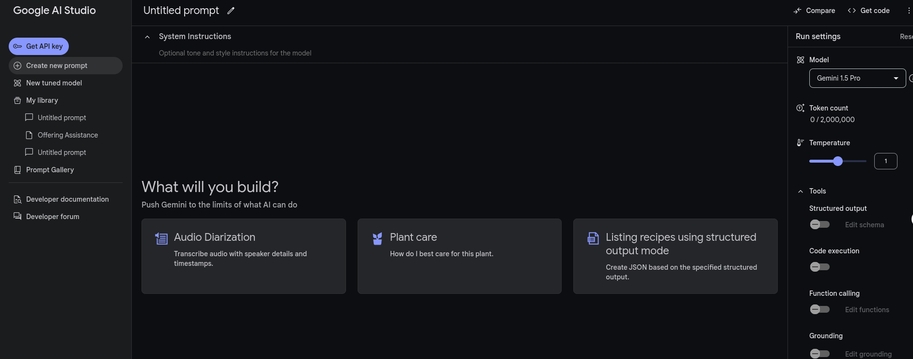
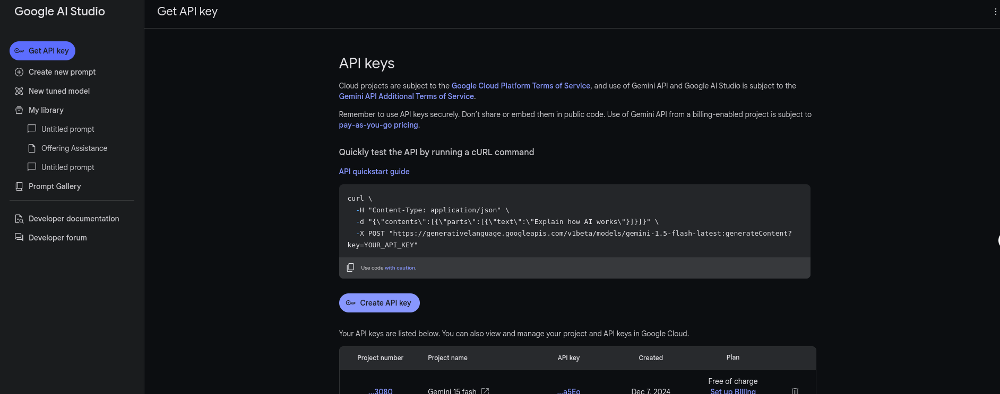
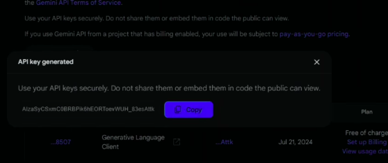

## AI

Thư mục này chứa các mô-đun AI và xử lý dữ liệu liên quan đến trí tuệ nhân tạo (AI). Gồm 2 chức năng là thực hiện chữ ký số  khi thêm con dấu vào file pdf và thêm 

```bash
├── digital_sig
│   ├── __init__.py
│   ├── insert_stamp.py
│   ├── main_digital_sig.py
│   ├── make_dig_sig.py
│   ├── requirements.txt
│   ├── sign_pdf.py
│   ├── utils.py
│   └── verify_pdf_signature.py
├── Dockerfile
├── __init__.py
├── main.py
├── ocr
│   ├── best.pt
│   ├── config.py
│   ├── __init__.py
│   ├── main_ocr.py
│   ├── models.py
│   └── utils
│       ├── image_utils.py
│       ├── __init__.py
│       ├── ocr_utils.py
│       └── yolo_utils.py
├── README.md
└── requirements.txt

```

# Tạo API Gemini 
## Bước 1: truy cập vào [link](aistudio.google.com) để vào trang tạo API, sẽ có giao diện như sau
## Bước 2: Nhấn vào *Get API key* ở góc trên bên phải để đến màn hình
## Bước 3: Chọn *Create API key* rồi chọn *Create API key in new project* hoặc chọn project có sẵn nếu có 
## Bước 4: Chọn *Copy* để sao chép API key rồi thực hiện lệnh sau để test API
```bash
curl "https://generativelanguage.googleapis.com/v1beta/models/gemini-1.5-flash:generateContent?key=${GEMINI_API_KEY}" \
    -H 'Content-Type: application/json' \
    -X POST \
    -d '{
      "contents": [{
        "parts":[{"text": "Write a story about a magic backpack."}]
        }]
       }'
```

**Ngoài ra**: Các bạn có thể thực hiện theo [Hướng dẫn](https://ai.google.dev/gemini-api/docs/api-key?hl=vi) này