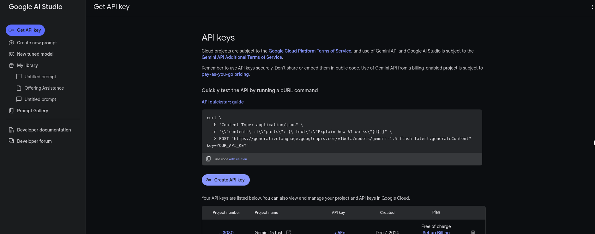
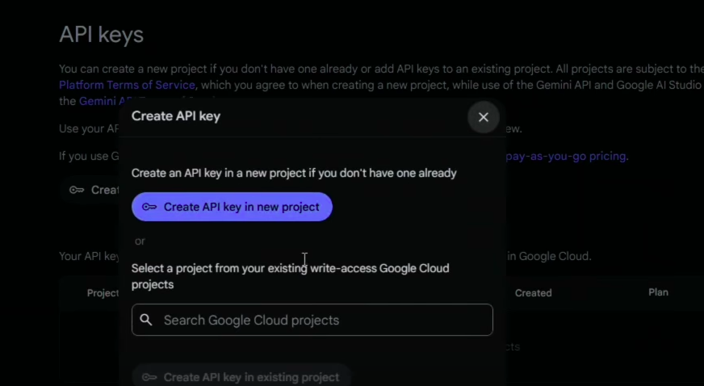
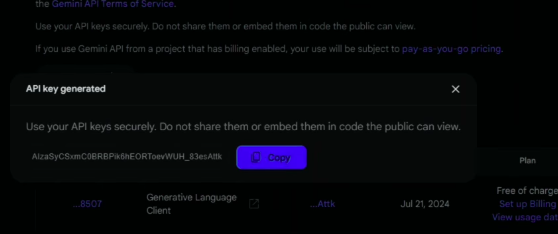

```bash
project-root/
├── app/
│   ├── api/
│   │   ├── __init__.py
│   │   ├── routes.py           # API route definitions
│   │   └── dependencies.py     # Shared dependencies for the API
│   ├── core/
│   │   ├── __init__.py
│   │   └── config.py           # Configuration settings (e.g., environment variables)
│   ├── models/
│   │   ├── __init__.py
│   │   └── response_model.py   # Response models or schemas
│   ├── services/
│   │   ├── __init__.py
│   │   ├── gemini_service.py   # Logic to interact with Gemini API
│   │   └── parsing_service.py  # Parsing or processing logic
│   ├── utils/
│   │   ├── __init__.py
│   │   └── file_utils.py       # File handling utilities
│   └── main.py                 # Entry point for FastAPI application
├── tests/
│   ├── __init__.py
│   ├── test_routes.py          # Unit tests for routes
│   └── test_services.py        # Unit tests for services
├── prompt.txt
├── README.md
├── requirements.txt            # Python dependencies
├── .env                        # Environment variables
└── .gitignore
```

# Tạo API Gemini 
## Bước 1: truy cập vào [link](aistudio.google.com) để vào trang tạo API, sẽ có giao diện như sau
## Bước 2: Nhấn vào *Get API key* ở góc trên bên phải để đến màn hình
## Bước 3: Chọn *Create API key* rồi chọn *Create API key in new project* hoặc chọn project có sẵn nếu có 
## Bước 4: Chọn *Copy* để sao chép API key rồi thực hiện lệnh sau để test API
```bash
curl "https://generativelanguage.googleapis.com/v1beta/models/gemini-1.5-flash:generateContent?key=${GEMINI_API_KEY}" \
    -H 'Content-Type: application/json' \
    -X POST \
    -d '{
      "contents": [{
        "parts":[{"text": "Write a story about a magic backpack."}]
        }]
       }'
```

**Ngoài ra**: Các bạn có thể thực hiện theo [Hướng dẫn](https://ai.google.dev/gemini-api/docs/api-key?hl=vi) này