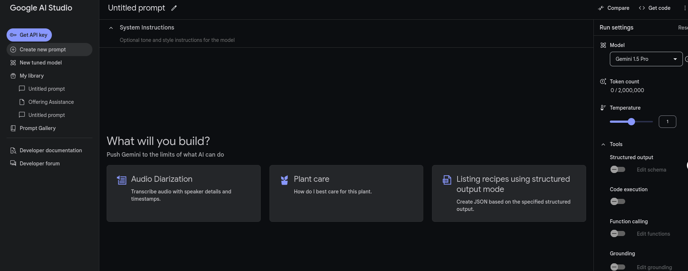

```bash
project-root/
├── best.pt
├── config.py
├── Dockerfile
├── __init__.py
├── main_ocr.py
├── models.py
├── README.md
└── utils
    ├── image_utils.py
    ├── __init__.py
    ├── ocr_utils.py
    └── yolo_utils.py
```

# Tạo API Gemini 
## Bước 1: truy cập vào [link](aistudio.google.com) để vào trang tạo API, sẽ có giao diện như sau
## Bước 2: Nhấn vào *Get API key* ở góc trên bên phải để đến màn hình
## Bước 3: Chọn *Create API key* rồi chọn *Create API key in new project* hoặc chọn project có sẵn nếu có 
## Bước 4: Chọn *Copy* để sao chép API key rồi thực hiện lệnh sau để test API
```bash
curl "https://generativelanguage.googleapis.com/v1beta/models/gemini-1.5-flash:generateContent?key=${GEMINI_API_KEY}" \
    -H 'Content-Type: application/json' \
    -X POST \
    -d '{
      "contents": [{
        "parts":[{"text": "Write a story about a magic backpack."}]
        }]
       }'
```

**Ngoài ra**: Các bạn có thể thực hiện theo [Hướng dẫn](https://ai.google.dev/gemini-api/docs/api-key?hl=vi) này