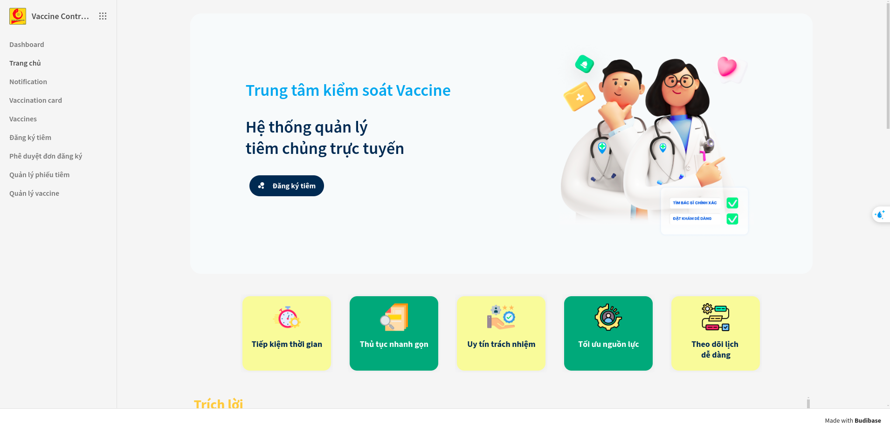
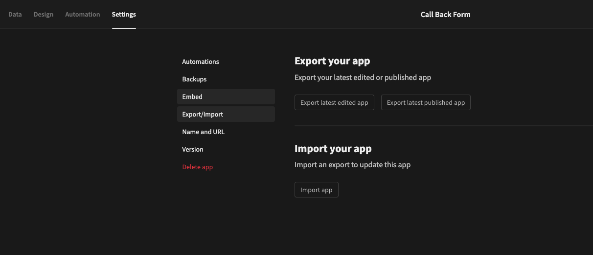

[](https://github.com/HaUI-AnodisO/Control-Vaccination-Services/blob/develop/LICENSE)
[](https://github.com/HaUI-AnodisO/Control-Vaccination-Services/issues)
[](https://github.com/HaUI-AnodisO/Control-Vaccination-Services/pulls)
[](https://github.com/HaUI-AnodisO/Control-Vaccination-Services/graphs/commit-activity)
[](https://github.com/HaUI-AnodisO/Control-Vaccination-Services/graphs/contributors)


# Control-Vaccination-Services

<a href="https://github.com/HaUI-AnodisO/Control-Vaccination-Services/issues/new?assignees=&labels=&projects=&template=bug_report.md&title=">Bug Report ⚠️</a>
<a href="https://github.com/HaUI-AnodisO/Control-Vaccination-Services/issues/new?assignees=&labels=&projects=&template=feature_request.md&title=">Request Feature 👩‍💻</a>
 



Ứng dụng quản lý tiêm chủng, phát triển trên nền tảng Budibase để tối ưu quy trình và giảm thao tác thủ công.

Mục tiêu phát triển ứng dụng quản lý tiêm chủng, phát triển trên nền tảng LCDP Budibase kết hợp với AI, tự động hóa quy trình để giảm thao tác thủ công và nâng cao hiệu quả quản lý.  

Dự án được thực hiện trong cuộc thi [Phần Mềm Nguồn Mở-Olympic Tin học Sinh viên Việt Nam 2024](https://www.olp.vn/procon-pmmn/ph%E1%BA%A7n-m%E1%BB%81m-ngu%E1%BB%93n-m%E1%BB%9F). Được được open source theo giấy phép [Apache License, Version 2.0](https://opensource.org/license/apache-2-0) bởi đội tác giả HaUI-AnodisO.

Để biết thêm chi tiết về cuộc thi, bạn có thể xem tại [đây](https://vfossa.vn/tin-tuc/gioi-thieu-chu-de-cuoc-thi-phan-mem-nguon-mo-olp-2024-709.html).

Link thuyết trình Canva tại cuộc thi [link]()

Slide bài thuyết trình tại cuộc thi dưới dạng PDF có thể được truy cập tại đây: [Slide]()

---
## 🔎 Danh Mục

1. [Giới Thiệu](#Giới-Thiệu)
2. [Chức Năng Chính](#chức-năng-chính)
3. [Tổng Quan Hệ Thống](#👩‍💻-tổng-quan-hệ-thống)
4. [Cấu Trúc Thư Mục](#cấu-trúc-thư-mục)
5. [Danh sách API](#api-list)
6. [Thiết kế Database](#thiết-kế-database)
7. [Hướng Dẫn Cài Đặt](#hướng-dẫn-cài-đặt)
    - [📋 Yêu Cầu - Prerequisites](#yêu-cầu-📋)
    - [🔨 Cài Đặt](#🔨-cài-đặt)
8. [CI/CD](#ci/cd)
9. [🙌 Đóng Góp](#🙌-đóng-góp-cho-dự-án)
10. [📝 License](#📝-license)


---


## Giới Thiệu
#### Viết lại
- [Công nghệ LCDP](https://vfossa.vn/tin-tuc/gioi-thieu-chu-de-cuoc-thi-phan-mem-nguon-mo-olp-2024-709.html) cho phép các công cụ cấu hình dễ dàng và triển khai nhanh chóng mà không cần phải lập trình nhiều.


---


## Chức Năng Chính
Dự án tập trung vào các chức năng chính sau:

#### Viết lại


---

## 👩‍💻 Tổng Quan Hệ Thống
#### Xem và viết lại

Hệ thống sử dụng kiến trúc [Layered Architecture](https://topdev.vn/blog/kien-truc-phan-lop-layered-architecture/) để dễ dàng cấu hình và phát triển các module. Các công nghệ sử dụng trong hệ thống bao gồm:


## CI/CD

#### Hoàn thiện và viết tiếp
Project CI/CD sử dụng Github và [Github Actions](https://github.com/Anodis108/HAUI-HITAnodisO/tree/develop/.github/workflows) để tự động hóa quá trình build và deploy. Quy trình như hình vẽ sau:


- [commitlint.yml](https://github.com/HaUI-AnodisO/Control-Vaccination-Services/blob/develop/.github/workflows/commitlint.yml): Lint các commit message của các nhánh


## Cấu trúc thư mục

### Sửa lại
- [Docs](docs): Tài liệu về hệ thống, cuoocj thi, sử dụng.
- [AI](AI/README.md): Tài liệu về module xử lý ảnh


---
## API List
#### Viết lại
---
## Thiết kế Database

---

## Hướng Dẫn Cài Đặt

### Yêu Cầu 📋
#### Viết thêm
Trước khi cài đặt, bạn cần cài đặt các công cụ sau:

- [Docker](https://www.docker.com/get-docker/)
- [Docker Compose](https://docs.docker.com/compose/install/)


### 🔨 Cài Đặt
#### Cài đặt budibase
Đầu tiên, ta cần cài đặt ứng dụng budibase về self-host, hoặc có thể sử dụng luôn chính website trang chủ budibase chính thức tại [đây](https://budibase.com/)

#### Để cài đặt budibase selfhost, ta thực hiện các bước như sau:
Bước 1. clone dự án budibase về máy của bạn:
```bash
git clone https://github.com/Budibase/budibase.git
```
Bước 2. cd vào thư mục hosting 
```bash
cd budibase/hosting/
```
Bước 3: Tạo tài khoản admin
- Bạn vào file .env, tìm đến và điền thông tin của mình ở phần này 
```bash
# An admin user can be automatically created initially if these are set
BB_ADMIN_USER_EMAIL=
BB_ADMIN_USER_PASSWORD=
```
Bước 4: chạy lệnh docker-compose
```bash
docker-compose --env-file hosting.properties up
```
Ứng dụng budibase của bạn sẽ chạy trên địa chỉ http://localhost:10000
#### Import dự án của chúng tôi
Trước hết, hãy clone dự án về máy tính của bạn:

```bash
git clone https://github.com/HaUI-AnodisO/Control-Vaccination-Services.git
```

Bạn sẽ thấy một file nén trong thu mục src/.   
Bây giờ, bạn hãy import thư mục nén này vào app budibase như sau họăc dựa theo [hướng dẫn này](https://docs.budibase.com/docs/export-and-import-apps#:~:text=Within%20the%20Apps%20screen%2C%20click,click%20Import%20app%20to%20finish.):  
Bước 1: Trên github, tại phần release có tệp nén **Vaccine.Control.Center-export-###.tar.gz** là phần EXport app của chúng tôi. Hãy lưu tệp đó về  
Bước 2: Mở ứng dụng và đăng nhập vào tài khoản  
Bước 3: Chọn ***Create new app*** để tạo mới app rồi chọn app mới đó  
Bước 4: Vào phần ***Settings***, chọn ***Export/Import*** rồi chọn ***Import app***
Bước 5: Chọn tệp **Vaccine.Control.Center-export-###.tar.gz** đã tải về trước đó, vậy là bạn đã có thể sử dụng dịch vụ của chúng tôi rồi


## 🙌 Đóng góp cho dự án

<a href="https://github.com/Anodis108/HAUI-HITAnodisO/issues/new?assignees=&labels=&projects=&template=bug_report.md&title=">Bug Report ⚠️
</a>

<a href="https://github.com/Anodis108/HAUI-HITAnodisO/issues/new?assignees=&labels=&projects=&template=feature_request.md&title=">Feature Request 👩‍💻</a>

Nếu bạn muốn đóng góp cho dự án, hãy đọc [CONTRIBUTING.md](.github/CONTRIBUTING.md) để biết thêm chi tiết.

Mọi đóng góp của các bạn đều được trân trọng, đừng ngần ngại gửi pull request cho dự án.

## Liên hệ 

-   Phạm Đăng Đông: dong10082003@gmail.com
-   Nguyễn Thị Trang: nguyenthitrang.ttd@gmail.com
-   Đỗ Trung Hòa: trunghoa2k4@gmail.com


## 📝 License

This project is licensed under the terms of the [APACHE V2](LICENSE) license.