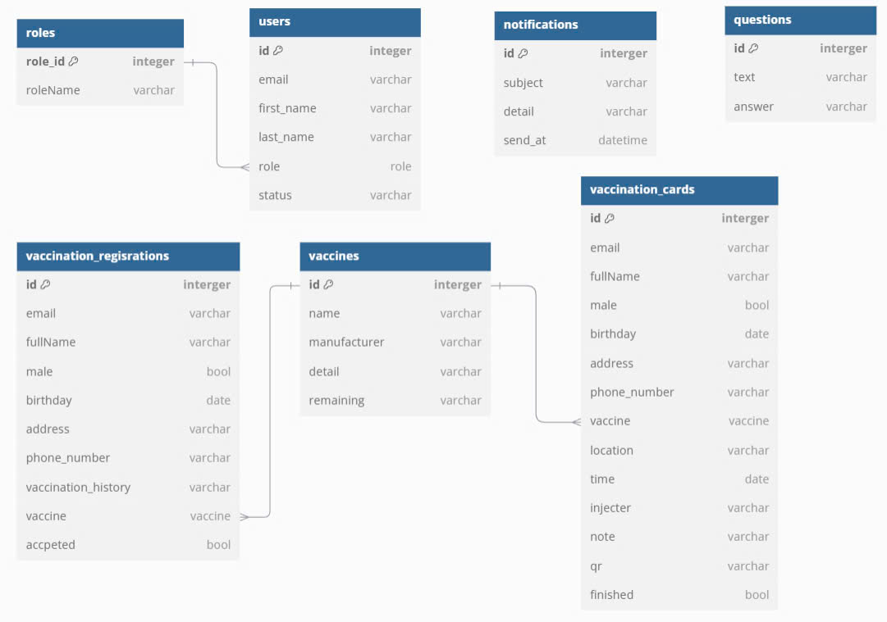

# Control-Vaccination-Services

# Tên ứng dụng là gì?

<a href="https://github.com/HaUI-AnodisO/Control-Vaccination-Services/issues/new?assignees=&labels=&projects=&template=bug_report.md&title=">Bug Report ⚠️</a>
<a href="https://github.com/HaUI-AnodisO/Control-Vaccination-Services/issues/new?assignees=&labels=&projects=&template=feature_request.md&title=">Request Feature 👩‍💻</a>
 

Giới thiệu lại

### Mục tiêu: 
#### Viết lại

---
## 🔎 Danh Mục

1. [Giới Thiệu](#Giới-Thiệu)
2. [Chức Năng Chính](#chức-năng-chính)
3. [Tổng Quan Hệ Thống](#👩‍💻-tổng-quan-hệ-thống)
4. [Cấu Trúc Thư Mục](#cấu-trúc-thư-mục)
5. [Danh sách API](#api-list)
6. [Thiết kế Database](#thiết-kế-database)
7. [Hướng Dẫn Cài Đặt](#hướng-dẫn-cài-đặt)
    - [📋 Yêu Cầu - Prerequisites](#yêu-cầu-📋)
    - [🔨 Cài Đặt](#🔨-cài-đặt)
8. [CI/CD](#ci/cd)
9. [🙌 Đóng Góp](#🙌-đóng-góp-cho-dự-án)
10. [📝 License](#📝-license)

---

## Giới Thiệu
#### Viết lại
- [Công nghệ LCDP](https://vfossa.vn/tin-tuc/gioi-thieu-chu-de-cuoc-thi-phan-mem-nguon-mo-olp-2024-709.html) cho phép các công cụ cấu hình dễ dàng và triển khai nhanh chóng mà không cần phải lập trình nhiều.

---

## Chức Năng Chính
Dự án tập trung vào các chức năng chính sau:

#### Viết lại

---

## 👩‍💻 Tổng Quan Hệ Thống
#### Xem và viết lại

Hệ thống sử dụng kiến trúc [Layered Architecture](https://topdev.vn/blog/kien-truc-phan-lop-layered-architecture/) để dễ dàng cấu hình và phát triển các module. Các công nghệ sử dụng trong hệ thống bao gồm:

## CI/CD

#### Hoàn thiện và viết tiếp
Project CI/CD sử dụng Github và [Github Actions](https://github.com/Anodis108/HAUI-HITAnodisO/tree/develop/.github/workflows) để tự động hóa quá trình build và deploy. Quy trình như hình vẽ sau:

- [commitlint.yml](https://github.com/Anodis108/HAUI-HITAnodisO/blob/develop/.github/workflows/commitlint.yml): Lint các commit message của các nhánh

## Cấu trúc thư mục

- [Backend](backend/README.md): Chứa các service backend, API, và các chức năng xử lý dấu.
- [Frontend](frontend/README.md): Giao diện người dùng, dễ sử dụng và có thể thao tác trên đó
- [Docs](docs): Tài liệu về hệ thống, cuoocj thi, sử dụng.
- [AI](AI/README.md): Tài liệu về module xử lý ảnh

---
## API List
#### Viết lại
---
## Thiết kế Database

---

## Hướng Dẫn Cài Đặt

### Yêu Cầu 📋
#### Viết thêm
Trước khi cài đặt, bạn cần cài đặt các công cụ sau:

- [Docker](https://www.docker.com/get-docker/)
- [Docker Compose](https://docs.docker.com/compose/install/)

### 🔨 Cài Đặt
#### Viết lại

## 🙌 Đóng góp cho dự án

<a href="https://github.com/Anodis108/HAUI-HITAnodisO/issues/new?assignees=&labels=&projects=&template=bug_report.md&title=">Bug Report ⚠️
</a>

<a href="https://github.com/Anodis108/HAUI-HITAnodisO/issues/new?assignees=&labels=&projects=&template=feature_request.md&title=">Feature Request 👩‍💻</a>

Nếu bạn muốn đóng góp cho dự án, hãy đọc [CONTRIBUTING.md](.github/CONTRIBUTING.md) để biết thêm chi tiết.

Mọi đóng góp của các bạn đều được trân trọng, đừng ngần ngại gửi pull request cho dự án.

## Liên hệ 

-   Phạm Đăng Đông: dong10082003@gmail.com
-   Nguyễn Thị Trang: nguyenthitrang.ttd@gmail.com
-   Đỗ Trung Hòa: trunghoa2k4@gmail.com

## 📝 License

This project is licensed under the terms of the [APACHE V2](LICENSE) license.